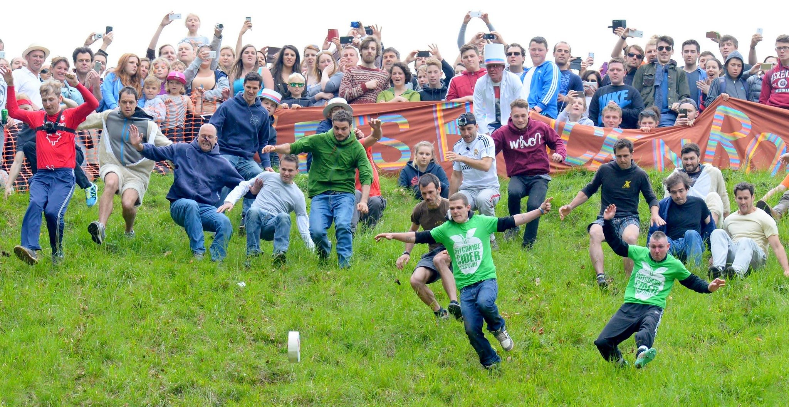

# The Fateful Day of the Great Cheese Rolling Catastrophe

Every year, the village of *Cooper's Hill*, nestled near Gloucester, England, bursts with excitement during the **annual Cheese Rolling Festival**. Families gather, with food stalls all across the streets, and the air filled with anticipation. But this year's festivities took an unexpected turn.

As the sun hung high in the sky, casting a warm glow over the countryside, crowds rushed to the top of *Cooper's Hill*. Excitement filled the air as participants prepared to participate in the age-old tradition of chasing a wheel of *Double Gloucester* cheese down the steep hill.

The atmosphere crackled with energy as the race began. Cheers erupted from the spectators as the cheese wheel was set in motion. However, in a twist of fate, the cheese veered off course, hurtling down the hill with unprecedented speed.

Panic swept through the crowd as chaos ensued. People stumbled and fell, some narrowly escaping collisions with others. Emergency services sprang into action, rushing to aid the injured and disoriented.

The phenomenon not only caused **minor** accidents like twisted wrists, but also near fatal concussions and spinal damage. Numerous people had to be escorted to the nearest hospital, some in life-or-death situation. They've been given a test ride with England's most up to date emergency service helicopter.

As the dust settled and tranquility returned to *Cooper's Hill*, the aftermath of the **Cheese Catastrophe** lingered. While no serious injuries were reported, the event served as a poignant reminder of the unpredictability that can accompany even the most anticipated traditions. Yet, despite the chaos, the spirit of community prevailed, as locals came together to support one another in the aftermath of the spicy twist to their beloved festival.
